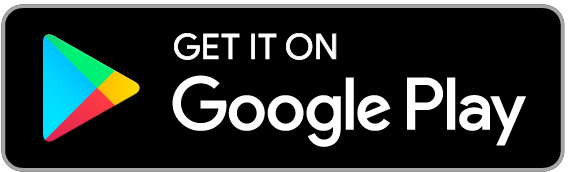
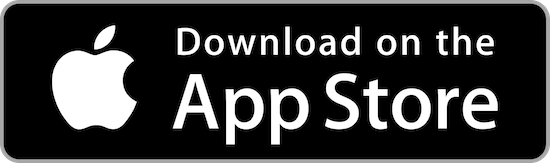

# EuropApp | Project Europe's Companion app

## User

Hello user! You can get this app in your hands easily:

## Developer

- Install Ionic: `npm install -g cordova ionic`
- Move to the `app` folder
- Start developing:
 - To serve the app on a local webserver, use `ionic serve`
 - To run on a local Android phone, use `ionic run android`
